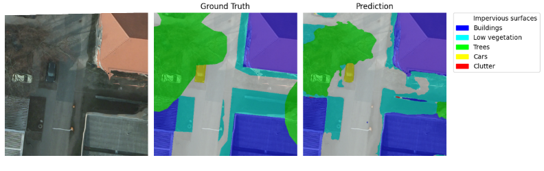

# Aerial Image Segmentation: CSE-Unet vs. Baseline U-Net

Course: Computational Intelligence

Project slides: [slides.pdf](docs/slides/out/slides-latest.pdf)

## Project Overview

This project investigates deep learning architectures for **semantic segmentation of high-resolution aerial imagery**, a critical task for urban planning, environmental monitoring, and automated mapping.

The primary objective is to compare standard deep learning baselines (U-Net with ResNet backbones) against specialized architectures designed for remote sensing, specifically the **Context and Semantic Enhanced U-Net (CSE-Unet)**. The project evaluates these models on stability, efficiency, and segmentation accuracy across complex urban classes.

## Motivation

Accurate segmentation is vital for up-to-date geospatial analysis, but manual annotation is costly and slow. While deep learning offers scalability, standard models often struggle with specific aerial challenges:

* **Intra-class heterogeneity:** Objects of the same class (e.g., roofs) looking vastly different.
* **Inter-class homogeneity:** Different classes (e.g., concrete vs. buildings) looking similar.
* **Small objects:** Difficulty detecting cars or narrow vegetation.

## Dataset

The project initially utilized the "Humans in the Loop" (Dubai) dataset but migrated to a higher-quality benchmark due to annotation inconsistencies.

* **Final Dataset:** **ISPRS Potsdam 2D Semantic Labeling Benchmark**.
* **Content:** High-resolution aerial tiles cleaned, split, and resized to .
* **Classes:** Impervious surfaces, Buildings, Low vegetation, Trees, Cars, Clutter.

## Architectures

### 1. Baseline: U-Net (ResNet34)

A standard U-Net architecture utilizing a **ResNet34 backbone** pre-trained on ImageNet. It serves as the control variable for performance comparison.

* **Parameters:** ~41M.

### 2. CSE-Unet (Context and Semantic Enhanced U-Net)

A specialized architecture designed to address semantic gaps in aerial imagery:

* **Multi-kernel Dual-path Encoder:** Extracts rich semantic information to distinguish similar-looking classes.
* **RFB-based Skip Pathways:** Uses Receptive Field Blocks to capture multi-scale context.
* **Parameters:** ~36M (approx. 12% fewer than baseline).

## Experiments & Methodology

Experiments were conducted in multiple phases to isolate the effects of architecture, data volume, and regularization techniques.

### Phase 1: Preliminary Comparison (Subset)

Tested ResNet50 Baseline vs. CSE-Unet on a small data subset (500 images).

* **Result:** CSE-Unet achieved competitive validation scores with significantly faster training and fewer parameters (36M vs 339M for ResNet50).

### Phase 2: Full Dataset & Optimization

Migrated to the full ISPRS Potsdam dataset (~3300 tiles).

* **Baseline Behavior:** Showed high volatility and "catastrophic collapse" around Epoch 50.
* **CSE-Unet Improvements:**
* Introduced **Dropout (0.2)** and **Weight Decay** to fix early overfitting.
* Exhibited smooth, linear convergence ("Slow Burner" effect).

### Phase 3: Advanced Loss Functions

Attempted to maximize performance using a combined **CrossEntropy + Dice Loss**.

* **Outcome:** Did not yield significant improvements over CrossEntropy alone for this dataset, leading to slightly unstable training dynamics.

## Key Results

The table below summarizes the best performance metrics on the validation set:

| Model | Accuracy | Dice Score | Jaccard (IoU) | Status |
| --- | --- | --- | --- | --- |
| **Baseline (ResNet34)** | 0.83 | 0.75 | 0.63 | Volatile / Collapsed |
| **CSE-Unet (Combined Loss)** | 0.77 | 0.66 | 0.54 | Unstable |
| **CSE-Unet (Phase 2)** | **0.87** | **0.78** | **0.67** | **Best & Stable** |

### Class-wise Performance (IoU)

*Performance of the best CSE-Unet model:*

* **Buildings:** 0.66
* **Low Vegetation:** 0.61
* **Impervious Surfaces:** 0.56
* **Cars:** 0.20 (Challenging due to small size and because only a few percent of pixels in the whole dataset have this class).

## Conclusions

1. **Stability > Raw Power:** The most significant finding was the difference in training dynamics. While the Baseline was volatile and prone to collapse, CSE-Unet demonstrated robust, stable learning curves.
2. **Efficiency:** CSE-Unet outperformed the baseline by **~4 p.p.** in IoU while using **fewer parameters** (36M vs 41M), validating the efficiency of Receptive Field Blocks.
3. **The "Slow Burner" Effect:** CSE-Unet learns complex semantic relationships gradually. The steady improvement curve suggests it had not yet fully converged, indicating potential for higher scores with extended training.
4. **Generalization:** The addition of dropout and weight decay was critical in closing the generalization gap for the CSE architecture.

---

### References

* *Wang, L. et al. (2020).* "A context and semantic enhanced UNet for semantic segmentation of high-resolution aerial imagery"
* *Kaiser, P. et al. (2017).* "Learning Aerial Image Segmentation From Online Maps."
* *Abdollahi, A. et al. (2021).* "Integrating semantic edges and segmentation information for building
extraction from aerial images using UNet"