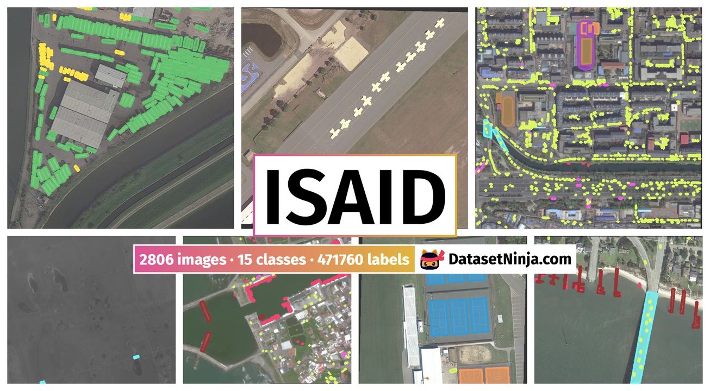

# Introduction

## Motivation

Accurate segmentation of aerial images is essential for generating up-to-date maps and understanding urban dynamics. Traditional manual mapping is slow and costly, while deep learning models offer a scalable solution. However, different architectures vary in their ability to handle challenges like shadows, small objects, and high intra-class variability. By systematically comparing these approaches, this project aims to identify the most effective model for reliable and efficient aerial image segmentation, contributing to improved automated mapping systems.

From my personal point of view, I work with geospatial data in my scientific research, where segmented aerial images play a crucial role in analysis and interpretation. Advancing and evaluating segmentation methods directly supports my work, as adopting the most effective approaches can significantly enhance the quality and impact of my research.

<!-- having better tools for aerial image segmentation would greatly benefit my projects.  -->

## Project overview

This project focuses on aerial image segmentation, a key task in remote sensing used for mapping, urban planning, and environmental monitoring. The goal is to compare the performance of different deep learning architectures, ranging from classic convolutional neural networks (CNNs) to advanced segmentation models such as U-Net, MultiRes-UNet, and CSE-UNet. Using publicly available datasets such as iSAID and Dubai Aerial Imagery, the project will evaluate model performance in terms of accuracy, generalization, and boundary precision.

## Literature overview

[**Learning Aerial Image Segmentation From Online Maps**](https://ieeexplore-1ieee-1org-1000047wi0086.wbg2.bg.agh.edu.pl/stamp/stamp.jsp?tp=&arnumber=7987710) [@kaiser2017learning] – This paper shows that CNNs can learn to segment aerial images using noisy labels from online maps like OpenStreetMap. The results demonstrate that large, imperfect datasets can reduce the need for manual annotation while maintaining good performance.

---

[**A context and semantic enhanced UNet for semantic segmentation of high-resolution aerial imagery**](https://iopscience.iop.org/article/10.1088/1742-6596/1607/1/012083/pdf) [@wang2020context] – This paper introduces CSE-UNet, a semantic segmentation network designed for high-resolution aerial imagery. It addresses labeling challenges caused by intra-class heterogeneity and inter-class homogeneity using multi-level receptive field blocks and a dual-path encoder for richer contextual and semantic features. Experiments on the ISPRS Potsdam and Vaihingen datasets show that CSE-UNet outperforms UNet and other deep networks.

---

[**Integrating semantic edges and segmentation information for building extraction from aerial images using UNet**](https://www.sciencedirect.com/science/article/pii/S2666827021000979) [@abdollahi2021integrating] – This paper proposes MultiRes-UNet, an enhanced deep-learning model for accurate building extraction from aerial imagery. By integrating multi-scale feature learning, improved skip connections, and semantic edge information, the network refines building boundaries and handles challenges like shadows and vegetation. Experiments show that MultiRes-UNet outperforms models such as UNet, DeeplabV3, and ResNet in roof segmentation accuracy.

## Related datasets

1. [Satellite images of Dubai, the UAE segmented into 6 classes](https://www.kaggle.com/datasets/humansintheloop/semantic-segmentation-of-aerial-imagery)

---

2. [iSAID: A Large-scale Dataset for Instance Segmentation in Aerial Images](https://openaccess.thecvf.com/content_CVPRW_2019/papers/DOAI/Zamir_iSAID_A_Large-scale_Dataset_for_Instance_Segmentation_in_Aerial_Images_CVPRW_2019_paper.pdf) – This paper introduces iSAID, the first large-scale benchmark dataset for instance segmentation in aerial imagery, featuring 655,451 objects across 15 categories. It combines object detection and pixel-level segmentation, addressing challenges like dense scenes and tiny objects. Results show that standard models like Mask R-CNN and PANet perform suboptimally, highlighting the need for specialized methods for aerial images.

---

