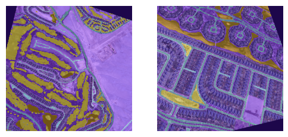
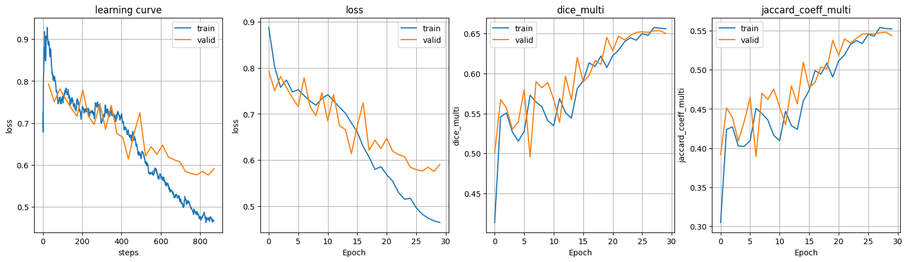
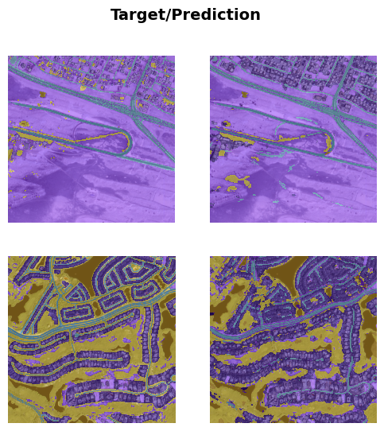

# Baseline Model

For this milestone, the primary objective was to establish a baseline model for the project. 

This process involved the preparation of the learning pipeline, selection of a simple architecture (**classic U-Net with Resnet50**), training the model on the dataset, and evaluation of its performance.

## Input Data and Augmentation

{height=85%}

## The model and the training process

{height=85%}

## Evaluation

{height=85%}

## Key notes, observations and findings

- Classic U-Net is not the best performing architecture for this task, but it serves as a good baseline (practical finding also confirmed with research papers). \
  **The result of ~65% Dice score is reasonable for a baseline attempt.**
- Other architectures:
  - There are U-Net variants with attention mechanisms that could be explored in future milestones.
  - Advanced U-Net variants achieve better performance on this dataset (~80% Dice score).
- Data augmentation plays a crucial role in improving model generalization, especially with limited data.
  - In aerial imagery, augmentations like rotations, flips, and color adjustments are particularly effective.
  - Moreover, in contrast to natural images, aerial imagery allows for bigger zoom levels without losing context, which can be leveraged during training.  

---

**Problems identified**:

- The dataset seems to be not entirely manually annotated, which may affect the model's performance –  further investigation is needed and **potentially changing the dataset**.
