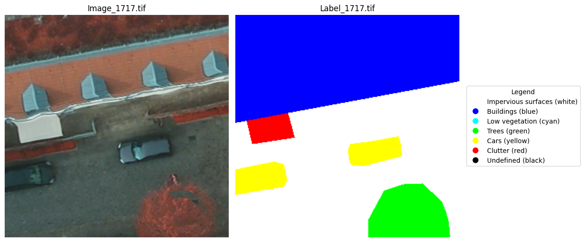
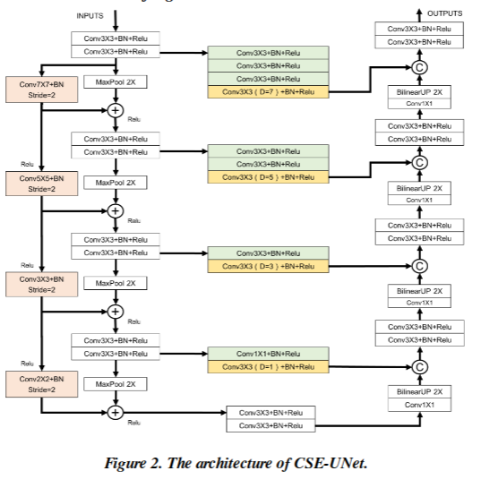

# First Implementation and Baseline Model Update

For this milestone, the goal was to **implement the CSE-Unet architecture** as described in the original paper.

In addition, the goal was to **revisit the baseline model** established in the previous milestone and train in on the **updated dataset**.

## Dataset Update

::::{.columns}
:::{.column width="47%"}

As identified in the previous milestone, the initial dataset had some issues with annotations.
For this milestone, a revised version of the dataset was obtained, with improved annotations.

\

After a brief research, a [\color{red}ISPRS Potsdam](https://www.isprs.org/resources/datasets/benchmarks/UrbanSemLab/2d-sem-label-potsdam.aspx) dataset was selected as a replacement, which is a well-known benchmark dataset for aerial image segmentation tasks. It contains high-resolution aerial images along with their corresponding pixel-wise annotations for various land cover classes.

<!-- The dataset consists of high-resolution aerial images along with their corresponding pixel-wise annotations for 7 classes: -->

:::
:::{.column width="47%"}

| Class ID | Class Name           | Color   |
|----------|----------------------|---------|
| 0        | Impervious surfaces | White   |
| 1        | Buildings           | Blue    |
| 2        | Low vegetation      | Cyan    |
| 3        | Trees               | Green   |
| 4        | Cars                | Yellow  |
| 5        | Clutter             | Red     |
| 6        | Undefined           | Black   |

:::
:::{.column width="6%"}
:::
::::

---

{height=90%}

---

Due to the simplicity of use, the dataset was accessed from Kaggle: [\color{red}ISPRS Potsdam dataset by Asad Iqbal](https://www.kaggle.com/datasets/deasadiqbal/private-data-1).

\

> Images are from the ISPRS Potsdam dataset. Each input image in the dataset was
> divided into image patches of size 300 × 300. These patches are divided into training (~2000
> images) and testing (~400 images) datasets.

**Important note:** To address the limitations of my computational resources, the models were trained on the subset of the dataset (200 images, train/test ratio preserved) and the images were resized to 256x256 pixels. 
For the final evaluation, I am planning to use the full dataset.

## Baseline model retraining

The baseline model from the previous milestone (classic U-Net with ResNet50 backbone) was retrained on the updated dataset twice:

1. With the pretrained weights from ImageNet (5 epochs freezed + 30 epochs unfrozen).
2. Without the pretrained weights. (38 epochs from scratch (early stopping)).

\vspace{1em}

\scriptsize

| Experiment         | Params | Epoch | Train Loss | Train Dice Multi | Train Jaccard Coeff Multi | Valid Loss | Valid Dice Multi | Valid Jaccard Coeff Multi | Time  |
|--------------------|--------|-------|------------|-------------------|---------------------------|------------|-------------------|---------------------------|-------|
| Baseline           | 339M | 38    | 0.869217   | 0.574932         | 0.414553                 | 1.053347   | 0.399294         | 0.275351                 | 00:45 |
| Baseline* | 339M | 29    | 0.465625   | 0.770685         | 0.645282                 | 0.493050   | 0.666335         | 0.557140                 | 00:56 |
<!-- | CSE-Unet           | 36M   | 56    | 0.854657   | 0.584462         | 0.434387                 | 0.808706   | 0.475868         | 0.345522                 | 00:14 | -->

\vspace{-2em}

\tiny

\* Baseline model with pretrained weights

\normalsize

The results of the pretrained model are getting closer to the ones reported in the original paper, although still not matching them.

## CSE-Unet Implementation

::::{.columns}
:::{.column width="47%"}

The CSE-Unet architecture was implemented as per the original paper, with the following key components:

\vspace{1em}

1. The Dual-Path Encoder
2. RFB-Based Skip Pathways
3. The Decoder

\vspace{1em}

The model was trained on the updated dataset for 56 epochs (early stopping) with the same training parameters as the baseline model.

:::
:::{.column width="47%"}

{height=90%}

:::
::::

---

\scriptsize

| Experiment         | Params | Epoch | Train Loss | Train Dice Multi | Train Jaccard Coeff Multi | Valid Loss | Valid Dice Multi | Valid Jaccard Coeff Multi | Time  |
|--------------------|--------|-------|------------|-------------------|---------------------------|------------|-------------------|---------------------------|-------|
| Baseline           | 339M | 38    | 0.869217   | 0.574932         | 0.414553                 | 1.053347   | 0.399294         | 0.275351                 | 00:45 |
| Baseline* | 339M | 29    | **0.465625**   | **0.770685**         | **0.645282**                 | **0.493050**   | **0.666335**         | 0.557140                 | 00:56 |
| CSE-Unet           | **36M**   | 56    | 0.854657   | 0.584462         | 0.434387                 | 0.808706   | 0.475868         | 0.345522                 | **00:14** |

\vspace{-2em}

\tiny

\* Baseline model with pretrained weights

\normalsize

<!-- We aim to get ~75% on the Jaccard Coeff (IoU) on the validation set -->

Please note that the CSE-Unet model has significantly fewer parameters (36M vs 339M) and trains much faster due to its efficient architecture. The performance on the test set is similar to the baseline model (trained from scratch). However, on the validation set it outperforms the baseline model approx. $25\%$, which indicates better generalization.

## Next steps

- Test baseline model with similar parameters count.
- **Train baseline model and CSE-Unet on the full dataset.**
- Tile-reconstruction for big-image segmentation.
