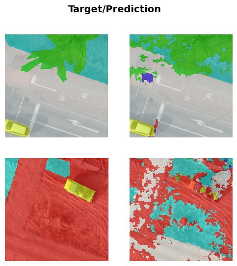

# Experiments

## Preliminary experiments recap

Experiments were conducted on a subset of the data (500 out of 2500 images).

\scriptsize

| Experiment         | Params | Epoch | Train Loss | Train Dice Multi | Train Jaccard Coeff Multi | Valid Loss | Valid Dice Multi | Valid Jaccard Coeff Multi | Time  |
|--------------------|--------|-------|------------|-------------------|---------------------------|------------|-------------------|---------------------------|-------|
| Baseline           | 339M | 38    | 0.869217   | 0.574932         | 0.414553                 | 1.053347   | 0.399294         | 0.275351                 | 00:45 |
| Baseline* | 339M | 29    | **0.465625**   | **0.770685**         | **0.645282**                 | **0.493050**   | **0.666335**         | 0.557140                 | 00:56 |
| CSE-Unet           | **36M**   | 56    | 0.854657   | 0.584462         | 0.434387                 | 0.808706   | 0.475868         | 0.345522                 | **00:14** |

\vspace{-2em}

\tiny

\* Baseline model with pretrained weights

\normalsize

<!-- We aim to get ~75% on the Jaccard Coeff (IoU) on the validation set -->

Please note that the CSE-Unet model has significantly fewer parameters (36M vs 339M) and trains much faster due to its efficient architecture. The performance on the test set is similar to the baseline model (trained from scratch). However, on the validation set it outperforms the baseline model approx. $25\%$, which indicates better generalization.

## The models

### Baseline

---

### CSE-Unet 

#### Base implementation

---

#### Updated implementation

**Changes**

- dropout (0.2) in DoubleConv blocks
- custom loss function: combined CrossEntropyLoss + DiceLoss
- technicalities: I used some tools for the first time

---

## Results

|   model                      |      t_loss |      t_dice_multi|    t_jaccard_coef_multi |    v_loss |      v_dice_multi|    v_jaccard_coef_multi |
|:-----------------------------|------------:|----------:|----------:|----------:|----------:|----------:|
| Baseline (ResNet34)     |    0.578534 |  0.730393 |  0.591593 |  0.691645 |  0.694157 |  0.54865 |
| CSE-Unet (Base)              |    **0.391817** |  **0.810424** |  **0.693776** |  **0.533609** |  0.743653 |  0.61987  |
| CSE-Unet (UI)                |    0.504399 |  0.776692 |  0.652036 |  0.544584 |  **0.747400**   |  **0.62012**  |

Total params:

<!-- - Baseline (resnet50): 339,071,460 -->
- Baseline (resnet34): 41,221,668
- CSE-Unet: 36,988,807

---

:::::::::::::: {.columns}
::: {.column width="50%"}

{height=80%}

:::
::: {.column width="50%"}

{height=80%}

:::
::::::::::::::

## Conclusions

### Key Findings
* **Efficiency vs. Performance:** 
  * **CSE-Unet** outperforms the **ResNet34 Baseline** by **~7 p.p.** in Jaccard Coeff Multi ($0.62$ vs $0.55$) with a comparable parameter count (~36M vs ~41M).
  * On the data subset, it achieved competitive validation scores against the massive **ResNet50 Baseline** (339M params) while training significantly faster.

\vspace{1em}

* **Architecture & Generalization:**
  * The **Updated Implementation** (Dropout 0.2 + Combo Loss) successfully mitigated overfitting. 
  * While raw metrics between Base and Updated CSE are similar, the Updated model shows a healthier convergence gap between training and validation loss.

<!-- ---

### Project Retrospective
* **Technical Pipeline:** Established a complete experimental workflow using modern logging/tracking tools for the first time.
* **Limitations:** 
  * Time constraints limited the scope of hyperparameter tuning, suggesting potential for further gains in the CSE architecture.
  * What is more, the models could actually benefit from more training time to fully converge.
* **Hyperparameter Differences:** Slightly different hyperparameters were used compared to the original paper due to several constraints, such as limited computational power. This may have contributed to the observed underperformance relative to the paper's reported results. Future work could involve further investigation into the impact of these hyperparameter choices and exploring additional configurations to bridge the performance gap. -->
