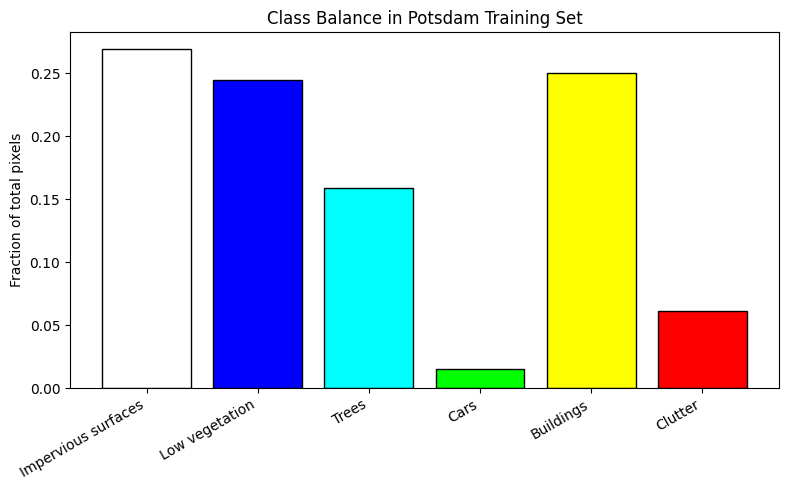
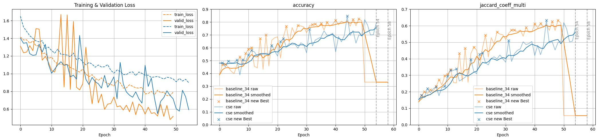
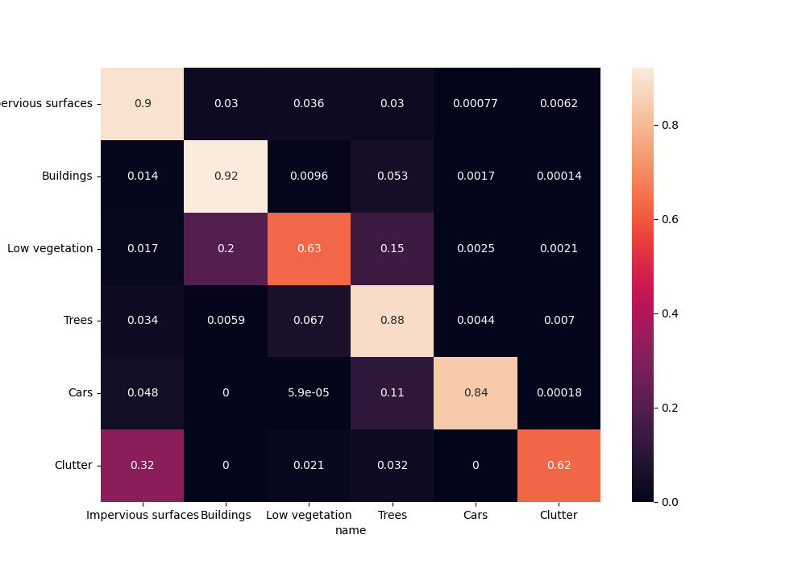
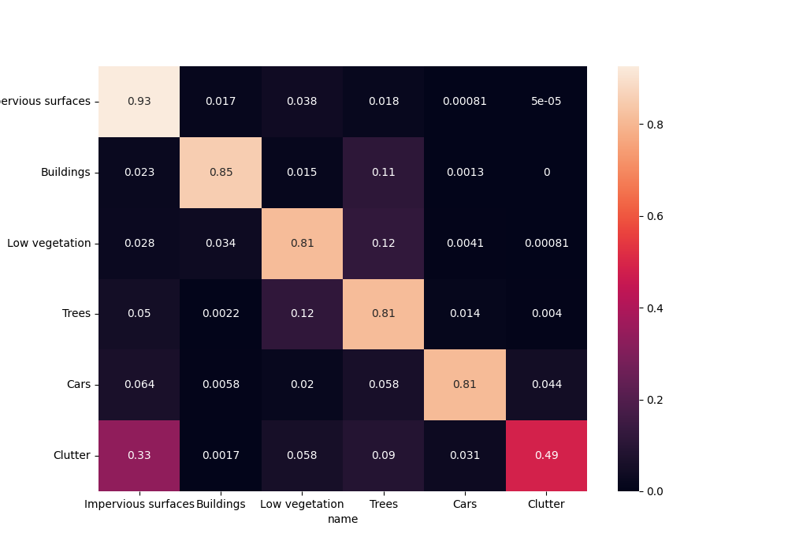
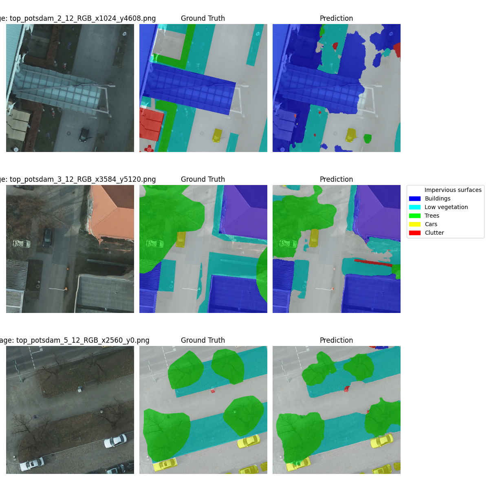
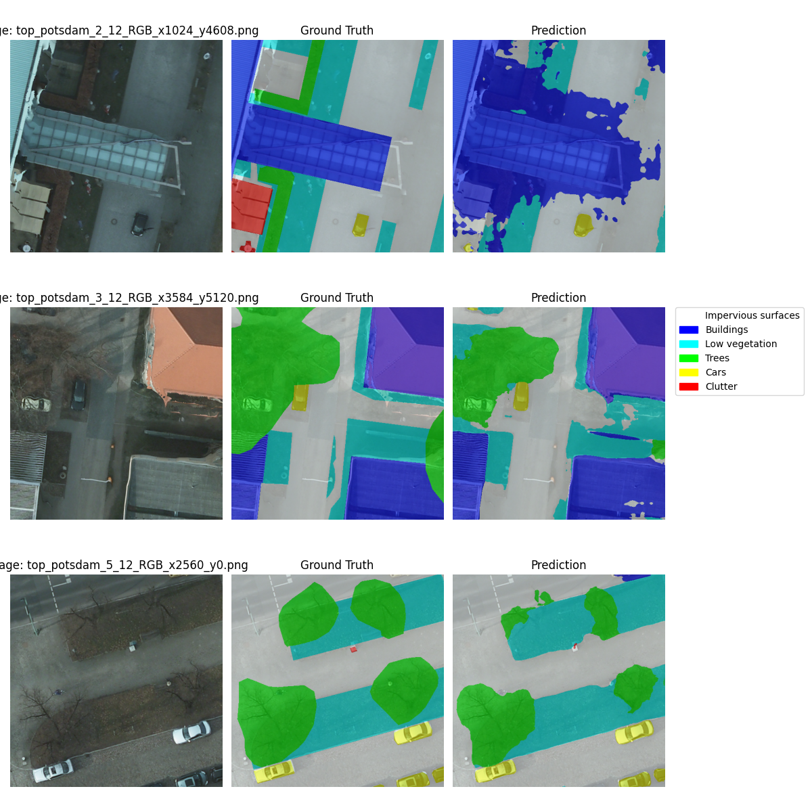
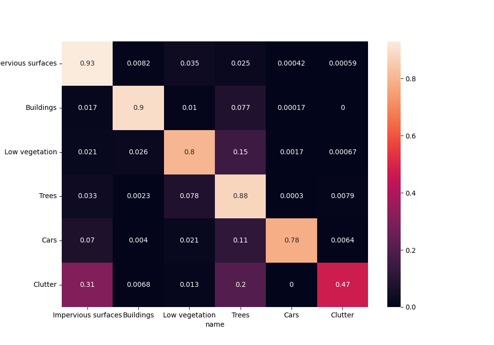
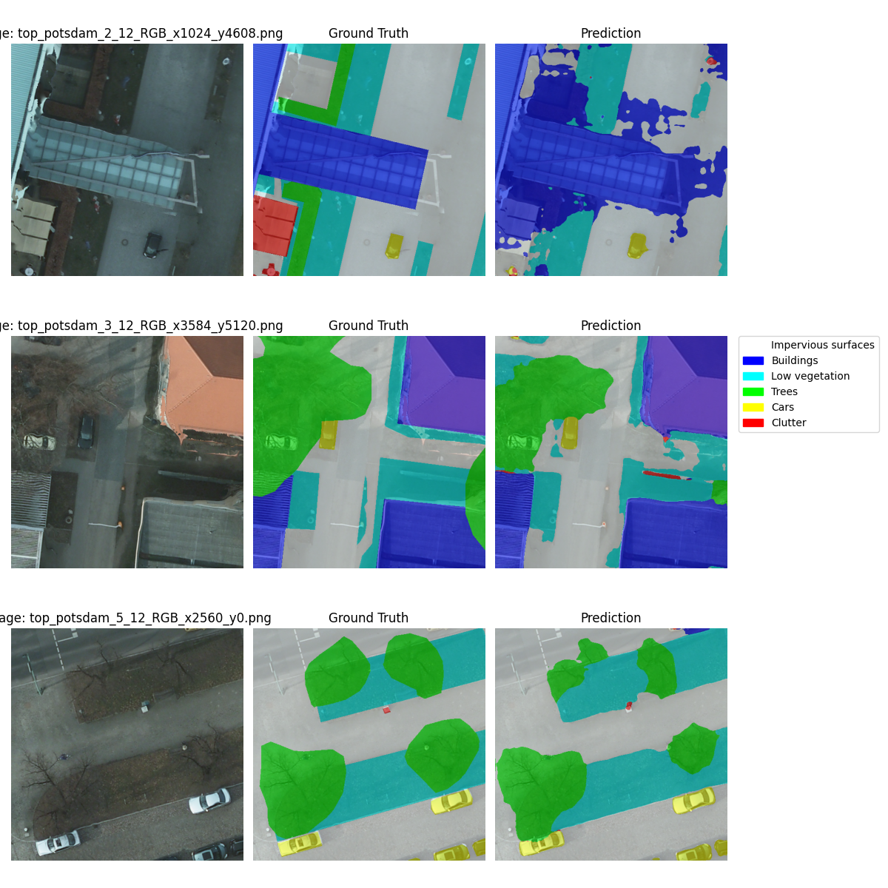

# More Experiments

## Previous Experiments Recap

Firstly, experiments on a subset of the data (500 out of 2500 images) were conducted to compare the baseline U-Net and CSE-Unet architectures. The baseline model, with 339M parameters, achieved a Jaccard Coefficient of 0.2754, while the CSE-Unet, with only 36M parameters, trained faster and reached a higher validation Jaccard score of 0.3455. Notably, using pretrained weights for the baseline improved its performance, yielding a score of 0.5571. Overall, the CSE-Unet demonstrated efficient training and competitive results despite its smaller size.

Then, further experiments were performed on the full dataset (2500 images) to evaluate the impact of dropout and a combined loss function on the CSE-Unet architecture. The base implementation of CSE-Unet showed signs of overfitting, with a significant gap between training and validation losses. By introducing a dropout rate of 0.2 in the DoubleConv blocks and employing a combined CrossEntropyLoss and DiceLoss, the updated implementation mitigated overfitting. Although raw metrics between the base and updated CSE models were similar, the updated model exhibited a healthier convergence gap, indicating improved generalization.

## Migration to Full Dataset

As the dataset provided on Kaggle was incomplete and seemd misslabeled, I migrated to a original full dataset provided by the [The International Society for Photogrammetry and Remote Sensing webpage](https://www.isprs.org/resources/datasets/benchmarks/UrbanSemLab/2d-sem-label-potsdam.aspx).

Such approach required some manual data preparation (i.e. cutting images into tiles, cleaning, splitting). However, the new dataset provided significantly more data ($\approx 3300$ 512x512 tiles after cleaning vs ~2400 256x256 tiles in the Kaggle dataset), which positively impacted the model performance and generalization.

---

{height=90%}

## Initial comparison

To assess model performance on the full dataset, I ran experiments with both the classic U-Net (using a ResNet34 backbone, matching the CSE-Unet in parameter count) and the CSE-Unet architecture enhanced with **dropout** and **weight decay**. Training settings largely mirrored previous experiments, with slight modifications to the learning rate and epoch count to better suit the expanded dataset.

- Learning rate: $\approx 1e-4$ (lr finder). 
- Training time: $\approx 50$ epochs (early stopping).
- Loss function: CrossEntropy*

I tried using the combined CrossEntropy + Dice loss, but for bigger input sizes it led to unstable training dynamics and worse preliminary results, as Dice loss is known to be unstable for the preliminary training stages.

---

---

- **Stability & Noise**: The CSE-Unet (Blue) demonstrates significantly smoother training curves across all metrics. In contrast, the Baseline (Orange) exhibits high volatility, with frequent, sharp spikes in validation loss and jagged "raw" metric lines.
- **Convergence Speed**: The Baseline reaches higher accuracy and Jaccard scores earlier in the training process (around Epoch 30–40), whereas the CSE-Unet follows a more gradual, linear improvement path.
- **Generalization Gap**: The gap between training and validation loss is narrower and more consistent for the CSE-Unet, suggesting that the architectural features and dropout are effectively regulating the model.
- **Late-Stage Collapse**: At approximately Epoch 50, the Baseline model experiences a total performance collapse. This suggests a "catastrophic forgetting" or an unstable gradient event that triggered the early stopping mechanism.
- **Convergence Illusion**: The CSE-Unet's steady improvement indicates it has not yet converged, while the Baseline's early plateau followed by collapse suggests it may have prematurely converged to a suboptimal solution.

---

:::: {style="display: flex;"}
:::

{width=45%}

:::
:::

{width=45%}

:::
::::

---

:::: {style="display: flex;"}
:::

{width=45%}

:::
:::

{width=45%}

:::
::::

## Further CSE Experiments

To take the advantage of the fact that CSE-Unet trains stably on the full dataset, I ran further experiments to improve its performance.

### "Phase 2"

Firstly, using the lowered lr, I trained the CSE-Unet for another 30 epochs. This led to steady improvements in validation metrics without overfitting.

### "Phase 3"

Then, I tried utilizing the combined CrossEntropy + Dice loss function again with low learning rate as it is known for the ability to "understand" the "object instances" better, as it cates to both pixel-wise accuracy and overall shape similarity. 
Unfortunately, the try did not lead to any improvements, but did not significantly degrade the overall performance either.

:::: {style="display: flex;"}
:::

{width=45%}

:::
:::

{width=45%}

:::
::::

---

:::: {style="display: flex;"}
:::

{width=45%}

:::
:::

{width=45%}

:::
::::

---

:::: {style="display: flex;"}
:::

{width=45%}

:::
:::

{width=45%}

:::
::::

---

:::: {style="display: flex;"}
:::

{width=45%}

:::
:::

{width=45%}

:::
::::

## Results summary

| Model               | Accuracy | Dice Multi | Jaccard Coeff Multi |
|---------------------|----------|------------|---------------------|
| baseline_34         | 0.83     | 0.75       | 0.63                |
| cse_combined_loss   | 0.77     | 0.66       | 0.54                |
| cse                 | 0.85     | 0.75       | 0.63                |
| cse_phase_2         | **0.87** | **0.78**   | **0.67**            |
| cse_phase_3         | 0.86     | 0.76       | 0.65                |

Please note that there was the idea to use Test Time Augmentation (TTA) to further boost the performance, but due to performance issues on the remote server, I was not able to run the TTA experiments successfully.

---

### IoU per class for the Phase 2 CSE-Unet model

To better understand the model performance across different classes, here are the Intersection over Union (IoU) scores for each class in the Phase 2 CSE-Unet model*:

| Class ID | Name                | IoU      |
|----------|---------------------|----------|
| 0        | Impervious surfaces | 0.56     |
| 1        | Buildings           | 0.66     |
| 2        | Low vegetation      | 0.61     |
| 3        | Trees               | 0.45     |
| 4        | Cars                | 0.20     |
| 5        | Clutter             | 0.34     |

\* to address performance issues, the Per class IoU was calculated based a subset of validation images (10%).

