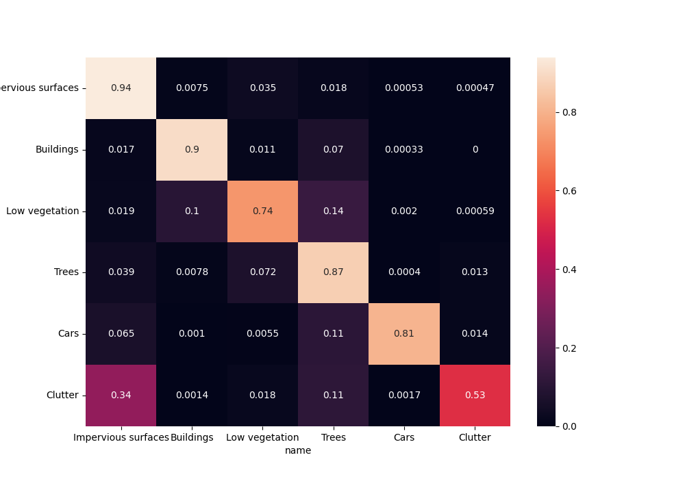
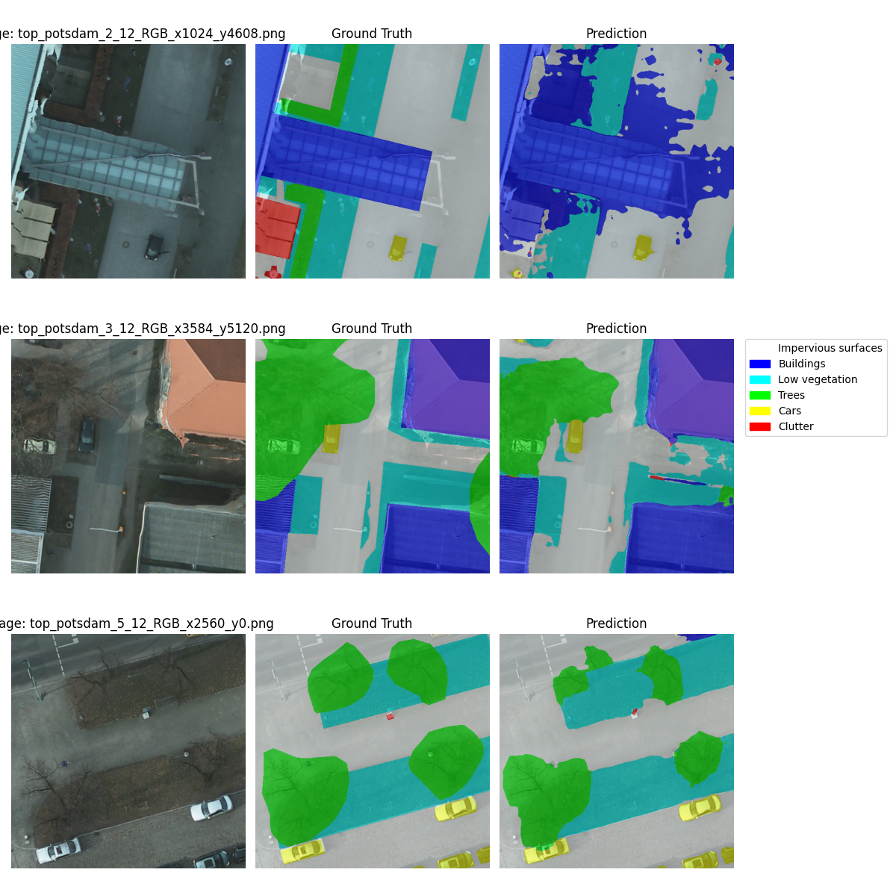

# Final experiments

To conclude the experiments on the new dataset, I performed a few additional experiments on the CSE-Unet model.

Recall: Current best model is cse_phase_2: best Jaccard Coef Multi 0.671; trained using lr-s `slice(1e-6, 1e-4)` and effective batch size of 16 (4 GPU batches × 4 accumulation steps).

---

\vspace{1em}
### "Phase 4"

All experiments were trained with warm-start from current best model weights (unless otherwise noted).

1. **cse_phase_4_1*** – 10x smaller learning rates, effective batch size 16 – to further stabilize training.
2. **cse_phase_4_1_combined_loss*** – warm-start from cse_phase_4_1, 10x smaller learning rates, effective batch size 16, combined CrossEntropy + Dice loss – to see if combined loss helps when training is stable.
3. **cse_phase_4_2_combined_loss*** – same learning rates, batch size 8 (no Gradient Accumulation) – to see if smaller batch size helps with combined loss.
4. **cse_phase_4_3_focal_loss*** – same learning rates, batch size 8 – to evaluate focal loss with these settings.

---

\scriptsize

|                             | loss          |   valid_loss |   accuracy |   jaccard_multi |
|:----------------------------|:--------------|-------------:|-----------:|----------------:|
| cse_phase_4_1               | Cross Entropy |        0.434 |      0.864 |       **0.681** |
| baseline_34_pretrained      | Cross Entropy |        0.485 |        N/A |           0.678 |
| cse_phase_2                 | Cross Entropy |        0.508 |  **0.868** |           0.671 |
| cse_phase_4_1_combined_loss | CE + Dice     |        0.53  |      0.86  |           0.669 |
| cse_phase_3                 | Cross Entropy |        0.529 |      0.855 |           0.652 |
| cse_phase_4_2_combined_loss | CE + Dice     |        0.454 |      0.834 |           0.646 |
| cse                         | Cross Entropy |        0.548 |      0.846 |           0.634 |
| baseline_34                 | Cross Entropy |        0.481 |      0.825 |           0.633 |
| cse_phase_4_3_focal_loss    | Focal         |        0.295 |      0.818 |           0.613 |
| cse_combined_loss           | CE + Dice     |        0.677 |      0.774 |           0.535 |

\normalsize

<!-- As we can see, the best model is cse_phase_4_1, which used 10x smaller learning rates than cse_phase_2. This shows that the model can still benefit from further training with a lower learning rate. -->

As we can see, the newly trained cse_phase_4_1 model outperforms both the previous best (cse_phase_2) and the baseline pretrained model, achieving the highest Jaccard coefficient and improved validation loss. 

---

:::: {.columns}
::: {.column width="50%"}

{height=100%}

:::
::: {.column width="50%"}

{height=100%}

:::
::::

<!-- NOTE: slight decrease on low vegetation, but improvement on small classes: cars and clutter  -->

---

:::: {.columns}
::: {.column width="50%"}

{height=100%}

:::
::: {.column width="50%"}

{height=100%}

:::
::::
